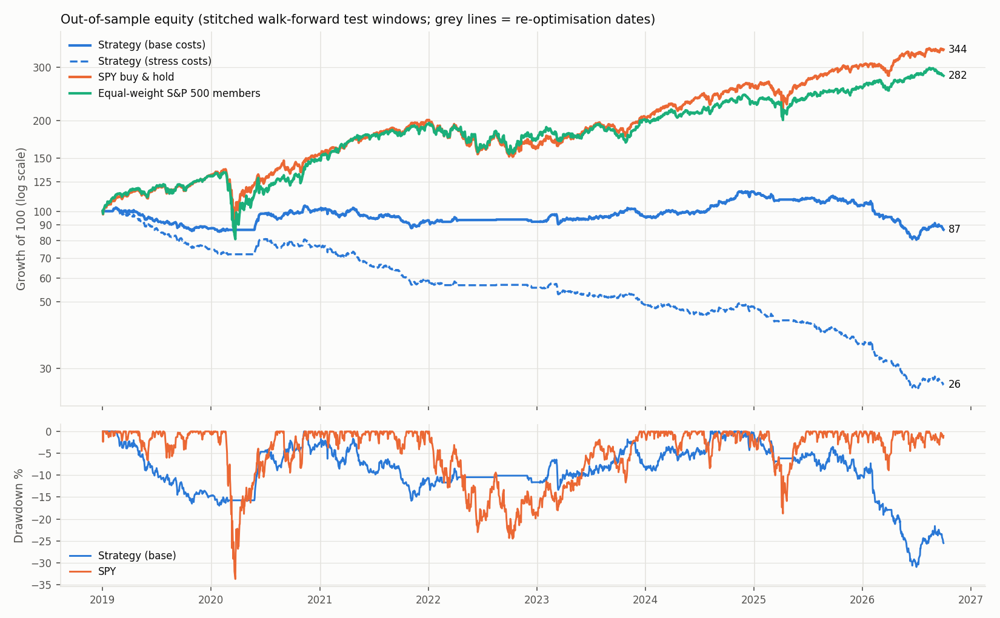
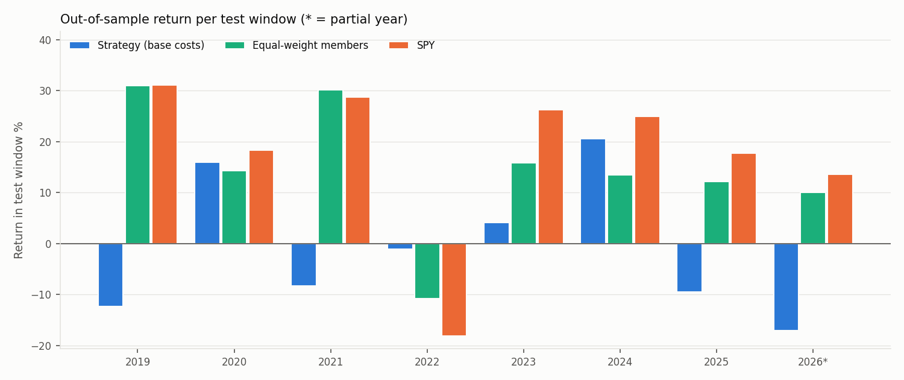
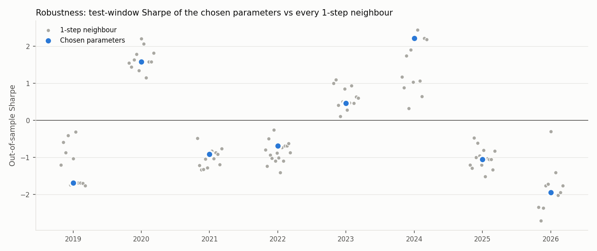

# Walk-Forward Backtest Report — Graph Stat-Arb Strategy (price-only)

> **Backtest, not live trading.** Every number below is **out-of-sample**: each test
> window was traded with parameters chosen only on the 3 years before it, and the
> test windows are stitched together. Period **2019-01-02 → 2026-09-30**, universe =
> **point-in-time S&P 500 members with Yahoo Finance prices**, long/short, costs
> stated below. **Survivorship bias remains** (delisted members are missing), so
> results are biased upward. The news-sentiment filter of the live bot is **not
> backtested** (no historical headline data).

## 1. Headline — out-of-sample, 2019-01-02 → 2026-09-30

| Book | CAGR | Volatility | Sharpe | Sortino | Max drawdown | Calmar | Total return |
|---|---|---|---|---|---|---|---|
| Strategy — base costs | -1.8% | 8.9% | -0.16 | -0.22 | -31.0% | -0.06 | -13.2% |
| Strategy — stress costs | -15.8% | 9.0% | -1.87 | -2.38 | -74.9% | -0.21 | -73.5% |
| _Diagnostic: same trades, zero costs_ | +5.9% | 8.9% | 0.69 | 1.00 | -23.4% | 0.25 | +56.1% |
| Benchmark: equal-weight S&P 500 members (same universe) | +14.3% | 20.2% | 0.76 | 1.08 | -40.0% | 0.36 | +181.7% |
| Benchmark: SPY buy & hold | +17.4% | 19.2% | 0.93 | 1.32 | -33.7% | 0.51 | +244.1% |

| Book | Trades | Win rate (net) | Avg holding (days) | Turnover (one-way/yr) | Avg gross exposure | Avg net exposure | Profit factor |
|---|---|---|---|---|---|---|---|
| Strategy — base costs | 5,777 (2,884 L / 2,893 S) | 55% | 1.7 | 75.6× | 49% | -0% | 0.98 |
| Strategy — stress costs | 5,777 (2,884 L / 2,893 S) | 50% | 1.7 | 73.2× | 50% | -0% | 0.79 |

Market exposure (daily-return regression on SPY): base beta **0.01**,
annualised alpha **-1.6%** (t = -0.49);
stress beta 0.01, alpha -16.9% (t = -5.23).
t-stat of the mean daily return, base: **-0.45** (|t| < 2 ≈ not distinguishable from zero).

Costs paid (base): trading $56,901, short borrow $940
on $100,000 starting capital. Exit reasons (base): RESIDUAL_REVERTED 5,596, TRAILING_STOP 147, STOP_LOSS 34.



## 2. Plain-language summary

**Bottom line: out of sample, the strategy does not beat its costs, and it
does not beat either benchmark.** Over 2019-01 → 2026-09, with parameters
re-chosen each year on the previous 3 years only, it returned **−1.8% a year
(Sharpe −0.16)** at base costs and **−15.8% a year** at stress costs. Holding
the same stocks equal-weighted earned +14.3% a year; SPY earned +17.4%. This
is a negative result. It is reported as it came out, with no re-tuning after
seeing it.

**What worked**

- **There is a small real-looking signal before costs.** Re-trading the exact
  same trades with zero costs gives +5.9% a year, Sharpe 0.69 (t ≈ 1.9, just
  short of the usual significance bar). The average trade earns **+8.5 bps**
  before costs. Stocks that lagged their correlated peers did tend to catch
  up, mostly on the long side (+15.6 bps per long trade vs +1.4 bps per
  short).
- **It really is market-neutral.** Beta to SPY is 0.01 and the correlation is
  0.02. It kept its losses small in the 2022 bear market (−1.1% vs SPY
  −18.2%), partly because the regime filter kept it out of the market on
  18.5% of all days.
- **The engineering held up.** There is no look-ahead (tested). Membership is
  point-in-time. Costs are modelled at two levels. The results are
  reproducible from committed data with SHA-256 hashes. 256 Optuna trials ran
  in 3.4 minutes on 4 cores.

**What did not work**

- **Costs kill it.** The strategy holds positions for only 1.7 days on
  average, so it turns the book over ~76× a year. A round trip costs 10 bps
  at base, more than the 8.5 bps average gross gain, and base costs totalled
  about $57k on $100k of capital over the period. Break-even is about
  4 bps per side, which is only realistic for an institution with very cheap
  execution.
- **The edge is not stable over time.** Only 3 of 8 test years were positive
  (2020, 2023, 2024). In every year, all ~12 neighbouring parameter sets had
  the **same sign** as the chosen one. The outcome was driven by the market
  regime of that year, not by the parameter choice: parameters barely matter,
  but the year does.
- **The in-sample optimisation was not convincing.** The chosen parameters
  averaged Sharpe 0.34 in training. The Deflated Sharpe Ratio (which corrects
  for trying 32 combinations) was at most 0.44 and never close to 0.95. In
  the first window, even the *best* training result was negative, and the
  strategy still traded. The parameters also jumped around from window to
  window: lookback 126 → 504 → 252, and alpha from 2.0 down to 0.25.
- **The search had not converged in-sample.** In 6 of 8 windows the best
  training score was still improving after trial 16 (latest at trial 31). More
  trials would likely raise the *in-sample* Sharpe. Given the neighbour and
  DSR evidence above, I did not expect that to fix the out-of-sample result,
  and I did not run more trials to find out.
- **The last 1.5 years were bad.** 2025 returned −9.6% and 2026 year-to-date
  −17.1%, with a −31% maximum drawdown in mid-2026. This happened even before
  costs (−1.1% and −11.7%).

**How to read the upward biases.** 14% of index member-days have no price data,
mostly companies that were delisted or acquired. The price-only strategy
therefore saw a friendlier universe than reality. Because the result is
negative even with that tailwind, the conclusion "does not survive costs"
holds.


## 3. Method

**Strategy.** Every 21 trading days, link S&P 500 members whose daily returns
were correlated ≥ `threshold` over the last `lookback` days. Each day, compute
every stock's *peer-implied* return by graph smoothing, `h = (I + αL)⁻¹x`, and the
residual `x − h`. Standardise the residual against that stock's previous
`z_window` residuals → z-score. At the close: **buy** the most negative
z ≤ −entry_z, **short** the most positive z ≥ +entry_z (max 5 long + 5 short,
10% of equity each), filled at the **next open**. Exit when |z| is back inside
`exit_z` (same z units as entry), on a stop of `stop_k` × daily σ (clamped 4–15%,
trailing once in profit), or after `max_hold` days. New entries only when SPY >
its 200-day average and VIX < 30.

**Data.** Yahoo Finance daily prices, split- and dividend-adjusted, downloaded
2026-09-30T17:14:53+00:00 (yfinance 1.2.0); S&P 500 membership history from
the public `fja05680/sp500` dataset. A stock can only enter the graph or be
traded on days it was an index member. 815 stocks were members at
some point in the span; 657 have Yahoo prices; **member-day coverage
86.4%** — the missing rest are mostly
delisted/acquired companies. On average 433 members
with prices per day.

*Data cleaning (every step listed):* (1) **ticker-reuse screen** — Yahoo files
prices under today's owner of a ticker, so some old index tickers show a
different company (e.g. "EP" = El Paso Corp until 2012, a tiny firm today).
Stocks with median dollar volume < $5M on their index-member days are never
traded: BBT ($2.3M), EP ($0.0M), PARA ($0.1M), SUN ($1.5M).
(2) **DHR** prices before the 2016 Fortive spin-off are blanked (Yahoo's adjusted
history is mis-scaled, creating a fake +61% day). (3) Every remaining
|daily return| > 50% on a member day (5) was checked:
all came with heavy trading volume, and most match known events (PG&E 2019,
the March 2020 oil crash, Globe Life 2024); Moderna 2026-08-19 is confirmed by
volume (~40× normal) only. All were **kept** — no clipping. Nothing else was modified.
SHA-256 of prices.parquet: `a7222df6245dee945087de224c377e7515059f12c7d3a7f49e5f0a8034f1ff84`.

**Costs** (every fill, per side, plus a borrow fee on shorts):

| Level | Commission | Slippage (½ spread + impact) | Total per side | Short borrow |
|---|---|---|---|---|
| Base | 1 bp | 4 bp | 5 bp | 50 bp/yr |
| Stress | 1 bp | 14 bp | 15 bp | 200 bp/yr |

Parameters were optimised under **base** costs only; the stress run re-trades the
same chosen parameters with higher costs. Cash earns 0% (no T-bill data), which
also means Sharpe uses a 0% risk-free rate. The "zero costs" row is a **diagnostic
only** (same parameters and signals, no costs) showing how much gross edge the
costs consume — it is not an achievable result.

**Walk-forward.** 8 windows: train 3 calendar years → test the next
year (2026 = Jan–Sep). Parameters re-chosen each window; positions carry over at
the switch instead of being force-closed.

**Search space** (grid, so "neighbour" is well-defined; ranges chosen from finance logic *before* seeing results):

| Parameter | Values | Why this range |
|---|---|---|
| lookback (correlation window, days) | [126, 252, 504] | 6 months–2 years: shorter = noisy correlations, longer = stale relationships |
| threshold (min correlation for a link) | [0.3, 0.35, 0.4, 0.45, 0.5, 0.55, 0.6] | < 0.3 links are mostly noise; > 0.6 leaves few links outside same-industry pairs |
| alpha (peer pull) | [0.25, 0.5, 1.0, 2.0] | log-spaced: peers barely matter → peers dominate |
| z_window (residual history, days) | [40, 60, 120] | ~2–6 months of the stock's own residual volatility |
| entry_z | [1.5, 1.75, 2.0, 2.25, 2.5, 2.75, 3.0] | < 1.5 fires constantly on noise; > 3 is too rare to trade |
| exit_z | [0.0, 0.25, 0.5, 0.75, 1.0] | 0 = wait for full reversion; 1 = take profit early |
| max_hold (days) | [5, 10, 15, 20] | short-term reversal literature: effects last ~1–4 weeks |
| stop_k (stop in daily σ) | [2.0, 2.5, 3.0, 3.5, 4.0, 4.5, 5.0] | 2σ = tight (stopped on noise), 5σ = loose |

**Fixed, not optimised:** 5 long + 5 short slots at 10% each, rebuild every 21 days,
regime filter (SPY 200-DMA, VIX 30), costs. **Sentiment threshold: not in the search
space** — no historical sentiment data exists.

**Optimiser.** Optuna TPE sampler (seed 42 + window), per window: 12 random
"coarse" trials, then TPE "fine" trials concentrated near the best so far.
Objective = Sharpe of daily net returns over the 3 training years (base costs);
< 30 trades → score −1. MedianPruner stops a trial early if its Sharpe after training
year 1 or 2 is below the median of earlier trials. 8 windows run in parallel on
4 cores; every trial is checkpointed to `results/optuna/window_<k>.log`.

**Trials run (multiple-testing count): 256** — complete 182,
pruned 74, failed 0. Plus 108
robustness evaluations (neighbours, below) that were **not** used to choose anything.
Optimisation wall-clock: 3.4 min
(budget 90 min; deadline hit: False).
One backtest (3 years, default params): 2.8 s
(signals 2.5 s + simulation 0.3 s).

## 4. Results by sub-period (each test window, out-of-sample)

| Test window | Strategy base | Strategy stress | Zero-cost diagnostic | EW members | SPY | Strat. Sharpe (OOS) | Train Sharpe (IS) | Strat. MaxDD | Trades |
|---|---|---|---|---|---|---|---|---|---|
| 2019-01-02→2019-12-31 | -12.3% | -25.1% | -5.2% | +31.0% | +31.1% | -1.69 | -0.33 | -16.5% | 766 |
| 2020-01-02→2020-12-31 | +16.0% | +2.6% | +23.2% | +14.3% | +18.3% | 1.67 | 0.20 | -5.2% | 597 |
| 2021-01-04→2021-12-31 | -8.3% | -23.5% | +0.3% | +30.1% | +28.7% | -0.85 | 0.64 | -14.4% | 880 |
| 2022-01-03→2022-12-30 | -1.1% | -5.3% | +1.1% | -10.8% | -18.2% | -0.21 | 0.29 | -3.5% | 210 |
| 2023-01-03→2023-12-29 | +4.1% | -12.0% | +13.1% | +15.9% | +26.2% | 0.46 | 0.41 | -7.4% | 819 |
| 2024-01-02→2024-12-31 | +20.5% | -2.0% | +33.5% | +13.4% | +24.9% | 2.18 | 0.24 | -4.3% | 1012 |
| 2025-01-02→2025-12-31 | -9.6% | -24.5% | -1.1% | +12.1% | +17.7% | -1.15 | 0.50 | -10.3% | 885 |
| 2026-01-02→2026-09-30 | -17.1% | -26.9% | -11.7% | +10.1% | +13.5% | -1.96 | 0.75 | -25.6% | 608 |

Strategy positive in **3 of 8** test windows; beat the equal-weight
universe in **3 of 8**.



## 5. Chosen parameters per window (stability check)

Parameters that jump around from window to window are a sign the optimiser is
fitting noise. **DSR** = Deflated Sharpe Ratio of the chosen in-sample result
given all trials in that window (probability the true IS Sharpe > 0 after the
selection effect; < 0.95 = the in-sample "best" is not statistically convincing).

| Test window | Train Sharpe (IS) | Trades (IS) | DSR | lookback | threshold | alpha | z_window | entry_z | exit_z | max_hold | stop_k |
|---|---|---|---|---|---|---|---|---|---|---|---|
| 2019-01-02→2019-12-31 | -0.33 | 2330 | 0.03 | 126 | 0.6 | 2.0 | 120 | 2.0 | 0.0 | 15 | 3.5 |
| 2020-01-02→2020-12-31 | 0.20 | 2415 | 0.11 | 504 | 0.4 | 2.0 | 40 | 2.0 | 0.0 | 15 | 5.0 |
| 2021-01-04→2021-12-31 | 0.64 | 2188 | 0.44 | 252 | 0.5 | 2.0 | 40 | 1.75 | 0.0 | 10 | 4.0 |
| 2022-01-03→2022-12-30 | 0.29 | 2411 | 0.14 | 252 | 0.5 | 1.0 | 60 | 2.0 | 0.25 | 15 | 4.5 |
| 2023-01-03→2023-12-29 | 0.41 | 1598 | 0.37 | 126 | 0.45 | 0.5 | 120 | 1.75 | 0.0 | 20 | 4.5 |
| 2024-01-02→2024-12-31 | 0.24 | 2107 | 0.12 | 252 | 0.4 | 0.25 | 40 | 1.75 | 0.25 | 20 | 5.0 |
| 2025-01-02→2025-12-31 | 0.50 | 2343 | 0.39 | 252 | 0.4 | 0.25 | 40 | 2.25 | 0.75 | 10 | 4.0 |
| 2026-01-02→2026-09-30 | 0.75 | 2508 | 0.22 | 252 | 0.3 | 0.5 | 40 | 1.5 | 0.0 | 10 | 5.0 |

## 6. Robustness — neighbouring parameters

For each window, every parameter was moved one grid step up/down (one at a time)
and re-traded on the same test window. A real edge should survive small changes;
a lone spike surrounded by bad neighbours is overfitting. (These runs start each
test window with no positions, so "chosen" can differ slightly from section 4,
where positions carry over between windows.)

| Test year | Chosen OOS Sharpe | Neighbours | Median neighbour OOS Sharpe | Neighbours with OOS Sharpe > 0 | Median neighbour IS Sharpe |
|---|---|---|---|---|---|
| 2019 | -1.69 | 11 | -1.21 | 0% | -0.64 |
| 2020 | 1.58 | 11 | 1.58 | 100% | 0.01 |
| 2021 | -0.92 | 13 | -1.04 | 0% | 0.50 |
| 2022 | -0.69 | 16 | -0.87 | 0% | 0.12 |
| 2023 | 0.46 | 12 | 0.55 | 100% | 0.23 |
| 2024 | 2.22 | 12 | 1.46 | 100% | 0.07 |
| 2025 | -1.06 | 14 | -1.05 | 0% | 0.29 |
| 2026 | -1.95 | 11 | -1.95 | 0% | 0.75 |



## 7. Convergence

| Test year | Trials | Pruned | Best IS Sharpe after half the trials | Best IS Sharpe final | Last improvement at trial # |
|---|---|---|---|---|---|
| 2019 | 32 | 16 | -0.33 | -0.33 | 4 |
| 2020 | 32 | 5 | -0.06 | 0.20 | 28 |
| 2021 | 32 | 11 | 0.50 | 0.64 | 24 |
| 2022 | 32 | 7 | 0.07 | 0.29 | 20 |
| 2023 | 32 | 8 | 0.29 | 0.41 | 31 |
| 2024 | 32 | 5 | 0.06 | 0.24 | 17 |
| 2025 | 32 | 17 | 0.50 | 0.50 | 1 |
| 2026 | 32 | 5 | 0.68 | 0.75 | 22 |

If the best in-sample score was still improving near the last trial, the search
had **not converged** — more trials might find a better *in-sample* score (which,
per sections 5–6, would not necessarily help out-of-sample).

## 8. Limitations — read before quoting any number

1. **Survivorship bias (upward).** Only 86.4% of index member-days have prices;
   the missing members are mostly companies that were acquired, went bankrupt or
   were delisted. Losers are under-represented, so both the strategy and the
   equal-weight benchmark are flattered. Membership filtering removes the
   "picked today's winners" bias but not this.
2. **Sentiment filter not backtested.** The live bot's VADER/FinBERT headline gates,
   LSTM forecast and ML "brain" model are all absent. This is the price-only core.
3. **Not the live bot's exact configuration** (different correlation window, α,
   no sector mask, different z definition) — this is a research backtest of the
   strategy idea.
4. **Costs are modelled, not measured.** Flat bps per side; no market-impact curve,
   no hard-to-borrow names, no borrow recalls, no short-sale restrictions. Fills at
   the open assume the open price was obtainable.
5. **0% risk-free rate** in Sharpe/Sortino and 0% on cash.
6. **Daily bars:** stop-losses use the day's high/low with pessimistic ordering.
7. **Multiple testing:** 256 trials across windows. The OOS design protects
   the headline from direct selection bias, but the *design* (search space, costs,
   windows) was chosen by a human who knows market history 2019–2026.
8. **Adjusted prices:** dividend-adjusted, so dividends are treated as reinvested
   for longs; shorts implicitly pay them (correct direction).

## 9. Reproduce

```
python -m pip install -r requirements-backtest.txt
python download_data.py                 # or use the committed data/ files (check SHA-256)
python run_walkforward.py --time-single
python run_walkforward.py --budget-min 90
python make_report.py
```
Seeds: numpy/random 42; Optuna TPE seed 42+window. Resuming an interrupted
run continues the saved studies but the sampler's random state restarts, so a
resumed run is not bit-identical to an uninterrupted one.
Versions: Python 3.11.15, numpy 2.4.3, pandas 3.0.1, Optuna 5.0.0.

Files: `oos_daily.csv` (equity curves + exposure), `oos_trades_base.csv` /
`oos_trades_stress.csv` (every trade), `oos_by_window.csv`, `windows.csv`
(chosen params), `all_trials.csv` (every Optuna trial), `neighbours.csv`,
`convergence.csv`, `summary.json`, `timing.json`, `optuna/` (checkpoints).
